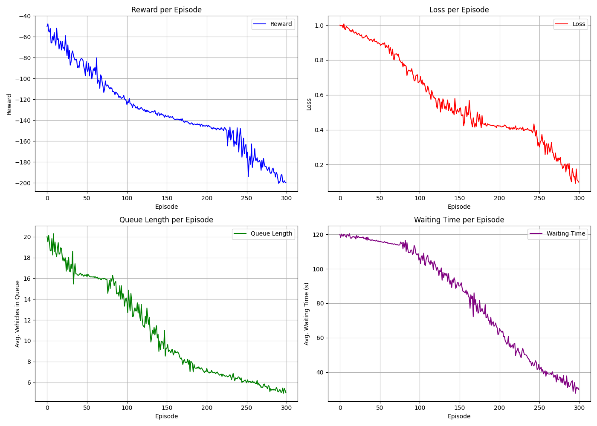

# 🚦 Adaptive Multi-Intersection Traffic Signal Control using GNNs and Deep Q-Learning 🧠

[](https://opensource.org/licenses/MIT)
[](https://www.python.org/)
[](https://pytorch.org/)
[](https://www.eclipse.org/sumo/)

## 📝 Overview

Urban traffic congestion remains a significant challenge, leading to increased travel times ⏳, fuel consumption, and environmental pollution. Traditional fixed-time or locally adaptive traffic signal controllers often struggle to manage complex, network-wide traffic dynamics effectively.

This project introduces an intelligent traffic signal control system designed to optimize traffic flow across a network of intersections. By leveraging advanced machine learning techniques, the system dynamically adapts signal phases based on real-time, network-wide traffic conditions.

**Objective:** To develop and rigorously evaluate a multi-agent deep reinforcement learning (MADRL) system using Graph Neural Networks (GNNs) to represent the traffic network state and Deep Q-Networks (DQN) to learn optimal signal control policies for multiple intersections simultaneously.

## ✨ Key Features

*   **Multi-Intersection Control:** Manages traffic signals at multiple intersections concurrently.
*   **GNN State Representation:** Captures spatial dependencies and network-level traffic patterns using PyTorch Geometric (PyG).
*   **Deep Q-Learning (DQN):** Employs Stable Baselines3 (SB3) for robust and efficient DQN implementation.
*   **SUMO Simulation:** Uses the microscopic traffic simulator SUMO (Simulation of Urban MObility) for realistic environment modeling.
*   **Adaptive Control:** Learns policies that adapt to dynamic traffic conditions.
*   **Modular Design:** Easily configurable components (network, agent, training parameters).

## 🔧 Technologies Used

*   **Simulation:** SUMO (Simulation of Urban MObility)
*   **Machine Learning:**
    *   PyTorch
    *   PyTorch Geometric (PyG)
    *   Stable Baselines3 (SB3)
*   **Environment Interface:** Gymnasium (formerly OpenAI Gym)
*   **Data Handling:** NumPy, Pandas
*   **Programming Language:** Python 3.9+

## ⚙️ Setup & Installation

1.  **Install SUMO:**
    *   Follow the official SUMO installation guide: [SUMO Installation](https://sumo.dlr.de/docs/Installing/index.html)
    *   Ensure the `SUMO_HOME` environment variable is set correctly.
    *   Verify that the `sumo` or `sumo-gui` executables are accessible from your terminal.

2.  **Clone the Repository:**
    ```bash
    git clone <your-repository-url>
    cd <repository-directory>
    ```

3.  **Create a Python Environment:** (Recommended)
    ```bash
    python -m venv venv
    source venv/bin/activate  # On Windows use `venv\\Scripts\\activate`
    ```

4.  **Install Dependencies:**
    ```bash
    pip install -r requirements.txt
    ```

5.  **Configure Paths:**
    *   Review `config.py` and adjust paths like `SUMO_EXECUTABLE`, `SUMO_CONFIG_FILE`, etc., if they differ from the defaults or your project structure.


## 🚩 Results


